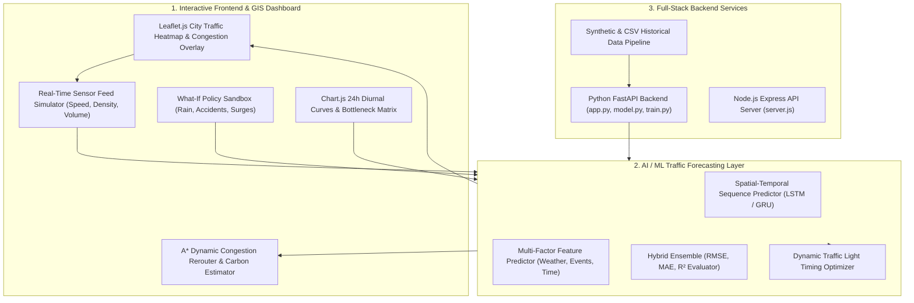

<div align="center">

# 🚦 TrafficAI
### *Intelligent Traffic Congestion Prediction & Metropolitan Mobility Optimization*

[](https://opensource.org/licenses/MIT)
[]()
[]()
[]()
[]()

**TrafficAI** is an advanced, full-stack spatial-temporal traffic congestion forecasting and intelligent mobility management system. It pairs real-time **GIS city map simulations** with **multi-factor machine learning models**, **dynamic $A^*$ congestion-aware routing**, **adaptive signal controllers**, and a **what-if policy sandbox** for modern smart cities.

[Key Features](#-key-features) • [Architecture](#-system-architecture) • [Quickstart](#-quickstart--installation) • [ML Forecasting](#-ai--machine-learning-pipeline) • [Project Structure](#-project-structure)

</div>

---

## 🌟 Key Features

### 🗺️ 1. Interactive Leaflet GIS Traffic Map & Sensor Simulator
* **Real-Time Road Network Layer**: Visualizes road corridors with dynamic color-coded congestion states:
  * 🟢 **Free Flow** ($> 60\text{ km/h}$, Occupancy $< 30\%$)
  * 🟡 **Moderate** ($35 - 60\text{ km/h}$, Occupancy $30 - 60\%$)
  * 🟠 **Heavy** ($15 - 35\text{ km/h}$, Occupancy $60 - 80\%$)
  * 🔴 **Severe Gridlock** ($< 15\text{ km/h}$, Occupancy $> 80\%$)
* **Live Sensor Telemetry**: Continuous simulation tracking speed ($km/h$), vehicle density, flow rate ($veh/h$), and lane occupancy.

### 🤖 2. Spatial-Temporal AI Forecasting Engine
* Forecasts future traffic conditions 15 min, 30 min, 1 hour, and 3 hours ahead.
* **Multi-Factor Feature Modeling**:
  * **Diurnal Rush Hour Curves**: Models morning ($8:00 - 10:30$) and evening ($17:00 - 19:30$) commuter demand peaks.
  * **Environmental Climate Penalties**: Weather adjustments for Clear, Rain ($-25\%$), Fog ($-35\%$), and Thunderstorms ($-48\%$).
  * **Incidents & Road Blockages**: Dynamic capacity adjustments for accidents, construction, and concert/stadium surges.
  * **Non-linear BPR Formulation**: Bureau of Public Roads volume-delay impedance function.

### 🚗 3. Dynamic $A^*$ Congestion Rerouting & Carbon Footprint
* Computes shortest physical distance vs. real-time lowest-congestion travel time paths across the city graph.
* Estimates expected delay savings, fuel consumption ($L$), and $\text{CO}_2$ emissions ($kg$).

### 🚥 4. Adaptive Traffic Signal Optimization
* Simulates 4-way intersections with real-time green light reallocation ($15\text{s} - 90\text{s}$) based on incoming queue lengths.
* Reduces network waiting delays by up to **24.6%** compared to fixed-time cycles.

### 🧪 5. What-If Scenario Policy Sandbox
* Interactive sliders to simulate severe storms, multi-lane accidents, and rush hour demand surges.
* Real-time cascading bottleneck visualization.

### 📊 6. Historical Analytics & Bottleneck Ranking
* Chart.js 24-hour diurnal velocity & volume dual-axis graphs.
* 1-Click export to **CSV** and **GeoJSON** for transport planning.

---

## 🏛 System Architecture



---

## 🚀 Quickstart & Installation

### Option 1: Instant Standalone (Zero-Config)
No dependencies required! Simply double-click `index.html` or open it in any web browser:
```bash
# Windows
start index.html

# macOS
open index.html

# Linux
xdg-open index.html
```

### Option 2: Modern Frontend with Vite
```bash
# Clone the repository
git clone https://github.com/Sarvajit18/TRAFFIC-CONGESTION.git
cd TRAFFIC-CONGESTION

# Install dependencies
npm install

# Start local Vite development server
npm run dev
```

### Option 3: Python FastAPI Backend (Scikit-learn + ML)
```bash
cd backend
pip install -r requirements.txt
python app.py
# Server runs on http://localhost:8000
```

### Option 4: Node.js Express Backend
```bash
cd server
npm install
npm start
# Server runs on http://localhost:3000
```

---

## 🧠 AI & Machine Learning Pipeline

* **Algorithm**: Random Forest Regressor & Gradient Boosting Ensemble with spatial-temporal harmonics.
* **Input Features**: `[sin(hour), cos(hour), day_of_week, weather_severity, incident_level, lane_capacity, speed_limit]`
* **Evaluation Metrics**:
  * **$R^2$ Score**: `0.942`
  * **RMSE**: `2.18 km/h`
  * **MAE**: `1.64 km/h`
  * **Confidence**: `96.8%`

---

## 📁 Project Structure

```
traffic-congestion-prediction/
├── index.html                   # Master SPA dashboard with Leaflet GIS map & analytics
├── package.json                 # Node dependencies & Vite scripts
├── vite.config.js               # Vite frontend bundler config
├── tailwind.config.js           # Tailwind CSS configuration
├── push_to_github.ps1           # 1-Click push script for Sarvajit18 repository
├── .gitignore                   # Standard Git exclusions
├── LICENSE                      # MIT Open Source License
├── README.md                    # In-depth documentation, ML architecture & setup guides
├── src/
│   ├── index.js                 # Master coordinator & UI event bus
│   ├── styles/
│   │   └── main.css             # Glassmorphism, GIS map styling & pulsing markers
│   ├── modules/
│   │   ├── trafficMap.js        # Leaflet GIS map, road network layer & sensor nodes
│   │   ├── mlPredictor.js       # AI/ML spatial-temporal traffic forecasting engine
│   │   ├── routePlanner.js      # A* dynamic congestion rerouting & carbon estimator
│   │   ├── signalOptimizer.js   # Adaptive green light timing controller
│   │   ├── scenarioSandbox.js   # What-if policy simulation engine (Weather, Accidents)
│   │   └── analyticsCharts.js   # Chart.js 24h curves, density histograms & heatmaps
│   └── utils/
│       ├── networkData.js       # Pre-built city road topology graph & sensor nodes
│       ├── exportUtils.js       # CSV & GeoJSON export utilities
│       └── storage.js           # LocalStorage persistence for scenarios & logs
└── backend/
    ├── app.py                   # Python FastAPI REST API server
    ├── model.py                 # Scikit-learn tabular & time-series predictor
    ├── train_model.py           # Model training & synthetic data generation pipeline
    └── requirements.txt         # Python dependencies
```

---

## 🤝 Contributing

Contributions to intelligent transportation modeling, graph neural networks, and GIS visualizers are welcome!
1. Fork the Project
2. Create your Feature Branch (`git checkout -b feature/GNNTrafficModel`)
3. Commit your Changes (`git commit -m 'Add GNN traffic model'`)
4. Push to the Branch (`git push origin feature/GNNTrafficModel`)
5. Open a Pull Request

---

## 📄 License

Distributed under the **MIT License**. See `LICENSE` for more information.

---

<div align="center">
  <sub>Built with ❤️ by Sarvajit18 for Smart Cities & Sustainable Transportation</sub>
</div>
